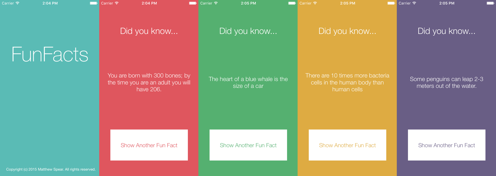

# FunFacts App

Update: 20/04/16 - Guide in progress, check back for update!

## The Project

FunFacts is an app that displays a random fun fact at the press of a button. Each time you pick a random fact it displays with a new background colour.

## Guide

### 1. Create a new project

### 2. Build the FactBook

### 3. Design the interface

### 4. Connect the interface

### 5. Write the code

### Extension Ideas

* Write a new ViewController to add your own facts to the app
* Click the fact to open a reference website
* Shake to show another facts

## Acknowledgement

The original idea for the project comes from Treehouse.
